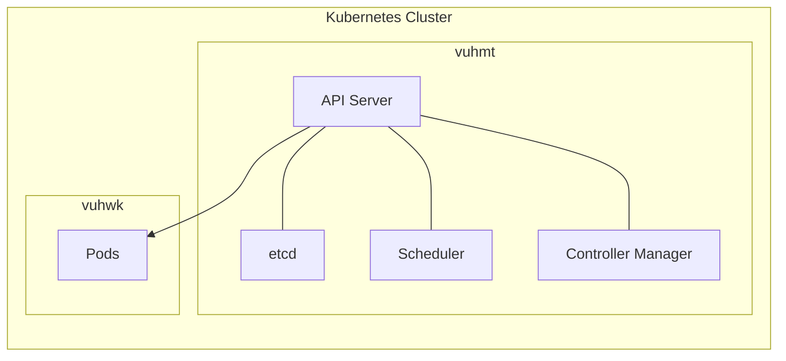

```mermaid
flowchart LR

subgraph Cluster["Kubernetes Cluster"]

subgraph ControlPlane["vuhmt"]

API["API Server"]

ETCD["etcd"]

Scheduler["Scheduler"]

Controller["Controller Manager"]

end

subgraph Worker["vuhwk"]

Pods["Pods"]

end

API --- ETCD
API --- Scheduler
API --- Controller

API --> Pods

end
```