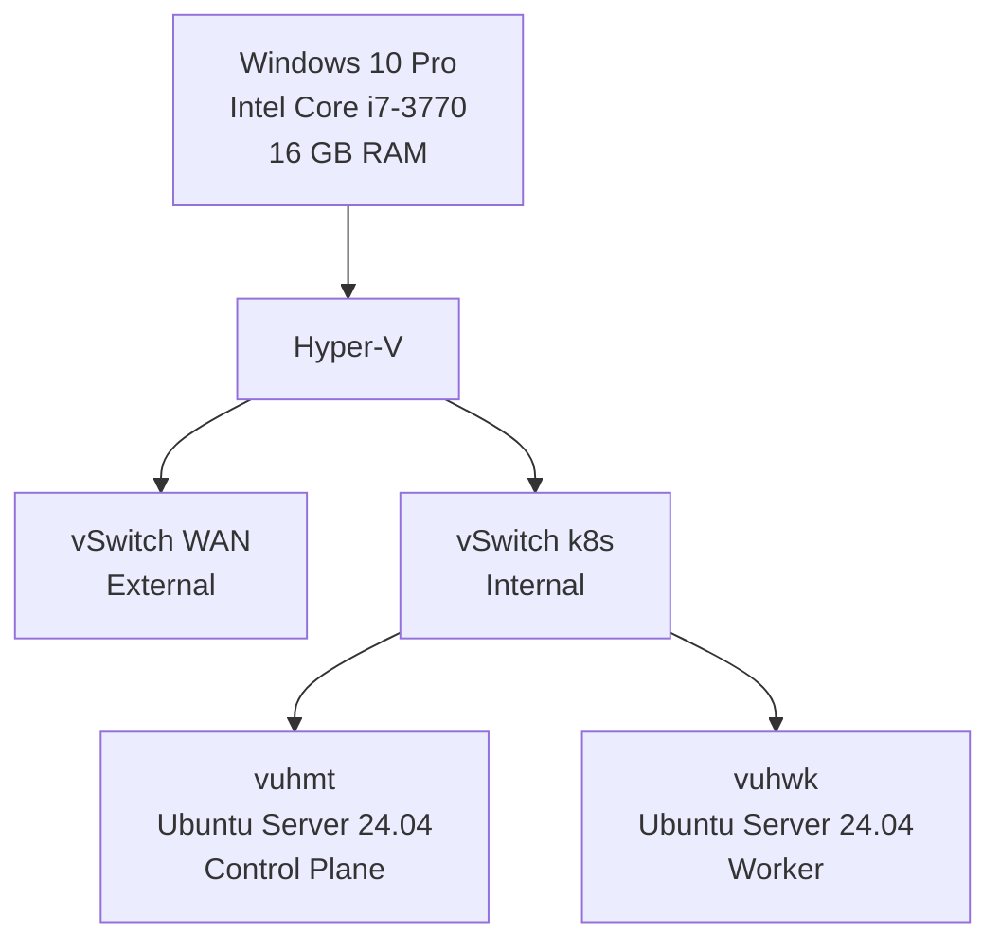

```mermaid
flowchart TB

Host["Windows 10 Pro<br/>Intel Core i7-3770<br/>16 GB RAM"]

HyperV["Hyper-V"]

WAN["vSwitch WAN<br/>External"]

K8S["vSwitch k8s<br/>Internal"]

Master["vuhmt<br/>Ubuntu Server 24.04<br/>Control Plane"]

Worker["vuhwk<br/>Ubuntu Server 24.04<br/>Worker"]

Host --> HyperV

HyperV --> WAN
HyperV --> K8S

K8S --> Master
K8S --> Worker
```