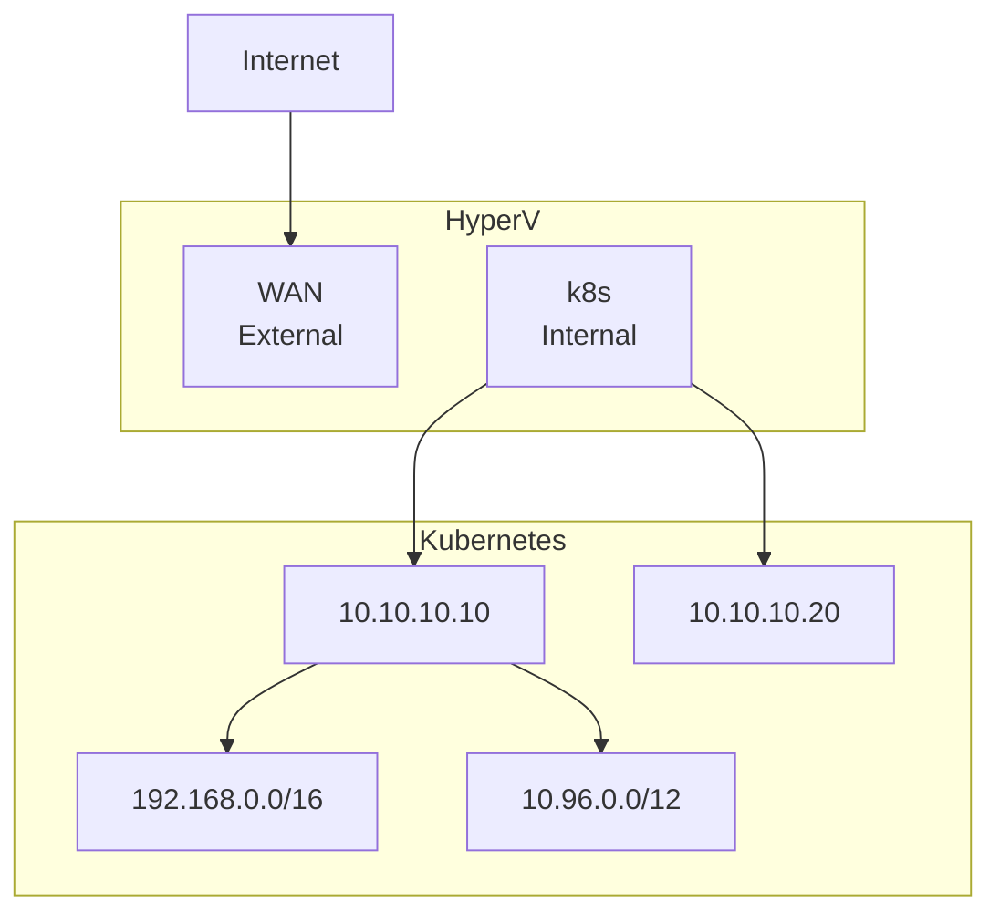

```mermaid
flowchart TB

Internet

subgraph HyperV

WAN["WAN<br/>External"]

K8S["k8s<br/>Internal"]

end

Internet --> WAN

subgraph Kubernetes

Master["10.10.10.10"]

Worker["10.10.10.20"]

Pods["192.168.0.0/16"]

Services["10.96.0.0/12"]

end

K8S --> Master

K8S --> Worker

Master --> Pods

Master --> Services
```