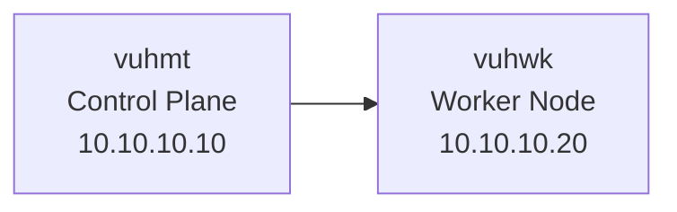

# Worker Node

## Objetivo

Este documento descreve a preparação, configuração e integração do Worker Node ao Kubernetes Lab.

O objetivo desta etapa foi expandir o cluster Kubernetes inicialmente criado com apenas um Control Plane, adicionando um nó dedicado para execução de workloads.

A implantação do Worker Node seguiu os mesmos padrões definidos para o ambiente, contemplando preparação do sistema operacional, configuração de runtime de containers, instalação dos componentes Kubernetes e integração com a rede do cluster.

---

# Identificação do Node

| Item | Valor |
|---|---|
| Hostname | vuhwk |
| Função | Worker Node |
| Sistema Operacional | Ubuntu Server 24.04 LTS |
| Endereço IP | 10.10.10.20 |
| Kubernetes | v1.35.7 |
| Container Runtime | containerd v2.2.6 |

---

# Preparação do Sistema Operacional

Antes da integração ao cluster Kubernetes foram realizadas as configurações iniciais do sistema operacional.

As principais configurações aplicadas foram:

- Configuração do hostname.
- Configuração do endereço IP estático.
- Desativação do uso de swap.
- Habilitação do encaminhamento IPv4.
- Validação dos módulos necessários para funcionamento da rede Kubernetes.

---

# Configuração de Rede

O hostname configurado no Worker Node foi:

```bash
hostname
```

Resultado:

```text
vuhwk
```

O encaminhamento IPv4 foi habilitado para permitir o funcionamento da comunicação de rede entre componentes Kubernetes.

Validação:

```bash
sysctl net.ipv4.ip_forward
```

Resultado:

```text
net.ipv4.ip_forward = 1
```

---

# Módulos do Kernel

O módulo necessário para funcionamento da rede Kubernetes foi validado:

```bash
lsmod | grep br_netfilter
```

Resultado:

```text
br_netfilter
bridge
```

A presença do módulo confirma que o ambiente está preparado para utilização do CNI responsável pela comunicação entre pods.

---

# Instalação do Container Runtime

O Kubernetes Lab utiliza o containerd como runtime padrão para execução dos containers.

A instalação contemplou:

- Instalação do pacote containerd.
- Criação do arquivo de configuração.
- Ajuste do gerenciamento de cgroups utilizando systemd.
- Configuração do serviço para inicialização automática.

---

## Configuração do containerd

O arquivo de configuração foi criado em:

```text
/etc/containerd/config.toml
```

A configuração de cgroup foi ajustada para utilização do systemd:

```toml
SystemdCgroup = true
```

---

## Validação do Serviço

O serviço containerd foi validado utilizando:

```bash
systemctl status containerd --no-pager
```

Resultado:

```text
Active: active (running)
```

---

## Validação da Versão

A versão instalada foi validada utilizando:

```bash
containerd --version
```

Resultado:

```text
containerd containerd v2.2.6
```

---

# Instalação dos Componentes Kubernetes

Foram instalados os componentes necessários para participação do Worker Node no cluster:

- kubeadm
- kubelet
- kubectl

A instalação utilizou o repositório oficial Kubernetes.

---

## Validação do kubeadm

A versão instalada foi validada utilizando:

```bash
kubeadm version
```

Resultado:

```text
v1.35.7
```

---

# Integração ao Cluster Kubernetes

A integração do Worker Node foi realizada utilizando o processo padrão de associação através do kubeadm.

O fluxo executado foi:

1. Geração do token de ingresso no Control Plane.
2. Execução do comando kubeadm join no Worker Node.
3. Registro do certificado do kubelet.
4. Validação do novo nó no cluster.

Após a execução do join, o Worker Node foi registrado com sucesso.

---

# Validação do Cluster

A validação foi realizada no Control Plane utilizando:

```bash
kubectl get nodes -o wide
```

Resultado:

```text
NAME    STATUS   ROLES           INTERNAL-IP
vuhmt   Ready    control-plane   10.10.10.10
vuhwk   Ready    <none>          10.10.10.20
```

O resultado confirma:

- Control Plane operacional.
- Worker Node registrado.
- Comunicação entre os nós funcionando.
- Kubelet autenticado corretamente.

---

# Integração com Calico

Após a entrada do Worker Node no cluster, os componentes de rede foram distribuídos automaticamente pelo Calico.

Validação:

```bash
kubectl get pods -A -o wide
```

Novo componente identificado:

```text
calico-node-vs52g
```

Executando no nó:

```text
vuhwk
```

Status:

```text
Running
```

O kube-proxy também foi criado no novo nó:

```text
kube-proxy-xggps
```

Status:

```text
Running
```

---

# Arquitetura Atual



---

# Troubleshooting

## Falha na configuração do repositório Docker

Durante a preparação do Worker Node ocorreu uma falha na validação da chave GPG do repositório Docker.

Erro identificado:

```text
NO_PUBKEY 7EA0A9C3F273FCD8
```

Causa identificada:

A chave GPG foi criada antes da instalação do pacote curl, ocasionando a criação de um arquivo inválido.

Correção aplicada:

- Instalação das dependências necessárias.
- Remoção da chave inválida.
- Criação novamente da chave GPG.
- Validação do repositório através do apt update.

Após a correção, o repositório Docker foi reconhecido corretamente.

---

# Resultado Final

O Worker Node foi integrado com sucesso ao Kubernetes Lab.

Estado atual:

- Cluster expandido para arquitetura multi-node.
- Control Plane operacional.
- Worker Node disponível para execução de workloads.
- Comunicação de rede validada através do Calico.
- Runtime containerd operacional.
- Ambiente preparado para implantação de aplicações e serviços.